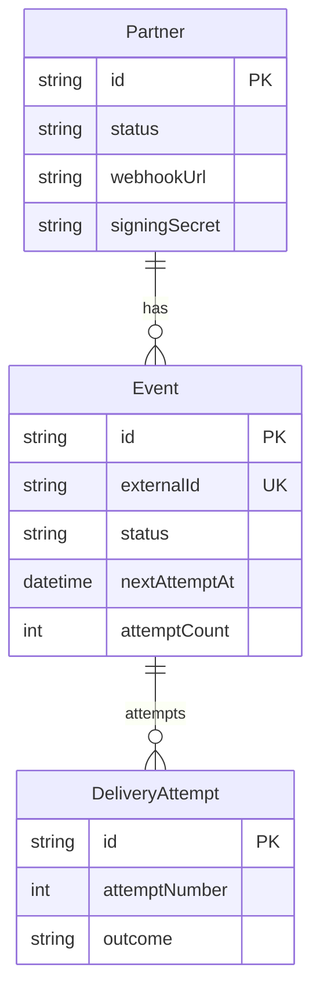
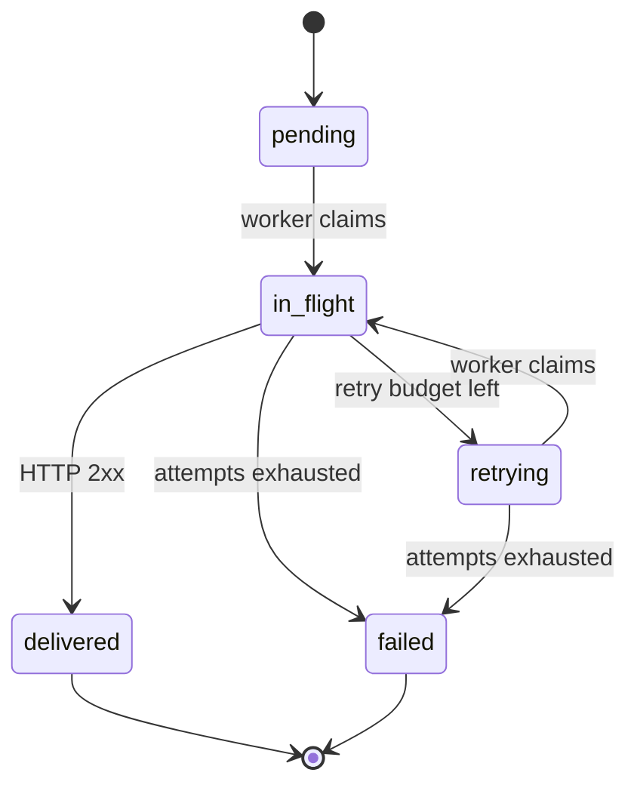

# Webhook.Core — design notes (assignment topics)

This document maps take-home topics to **concrete code**. Line numbers refer to the repository state on branch `kartavya-dev-webhook` and may drift slightly as files evolve—search by symbol if needed.

## 1) Data model

**Schema:** [`backend/prisma/schema.prisma`](backend/prisma/schema.prisma) defines `Partner`, `Event`, and `DeliveryAttempt` with the indexes required for filtering jobs (`@@index([status, nextAttemptAt])`, `@@index([partnerId, createdAt])`, …).

**ER (conceptual)**

**State machine (`Event.status`)**

## 2) Retry strategy

Backoff schedule and jitter live in [`backend/src/utils/backoff.js`](backend/src/utils/backoff.js) (`SCHEDULE_SEC`, `backoffSecondsAfterFailure`).

Single-attempt processing and transition rules are in [`backend/src/services/delivery.service.js`](backend/src/services/delivery.service.js): HTTP success marks `delivered`; failures consult `attemptCount` vs `maxAttempts`; otherwise the event returns to `retrying` with a future `nextAttemptAt`.

**Crash between attempts:** if a worker dies while `in_flight`, [`backend/src/jobs/lease-sweeper.js`](backend/src/jobs/lease-sweeper.js) periodically moves stale locks back to `retrying` so another worker can pick the job up after the lease timeout window defined in the assignment.

## 3) Ordering + throughput

Atomic claim lives in [`backend/src/jobs/delivery-worker.js`](backend/src/jobs/delivery-worker.js): the `UPDATE … WHERE id = (SELECT … FOR UPDATE SKIP LOCKED …)` pattern enforces **one active delivery per partner** via `NOT EXISTS` while allowing different partners to progress concurrently (`SKIP LOCKED`).

**Throughput trade-off:** each partner’s outbound throughput is roughly bounded by **one in-flight delivery at a time**, i.e. ~ `1 / mean_delivery_latency` deliveries/sec for that partner (plus scheduling/backoff constraints).

## 4) Idempotency

**Ingestion:** duplicate protection is enforced with `externalId` uniqueness in Prisma and idempotent handling in [`backend/src/services/event.service.js`](backend/src/services/event.service.js) including a `P2002` race path.

**Delivery:** the claim `UPDATE` is atomic; combined with the per-partner `NOT EXISTS` guard, the system avoids double-sending to the same partner concurrently for distinct events.

If `externalId` uniqueness were removed, replayed upstream publishes could create duplicate logical events; if the atomic claim were replaced with non-transactional read/modify/write, workers could double-deliver under concurrency.

## 5) Scaling

First bottleneck is typically **single Postgres** receiving both ingest writes and worker polling hot paths.

Mitigations (incremental): read replicas for analytics, partitioning hot tables (`Event`) by `partnerId`, dedicated queue infrastructure (Kafka/SQS/Rabbit) if polling latency dominates, or splitting OLTP vs analytics workloads.

## 6) Trade-offs (explicit)

- No end-user auth on the dashboard/API (assignment scope).
- No signing-key rotation UX (secrets are generated once at partner creation).
- No DLQ beyond terminal `failed` status (operators inspect via UI/API).
- No per-partner HTTP rate limiting inside this codebase (could be added at egress).
- Workers poll Postgres rather than `LISTEN/NOTIFY` (simpler ops; slightly higher DB chatter).
