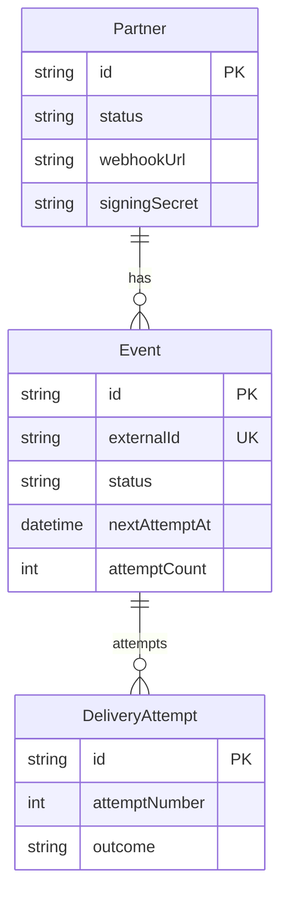
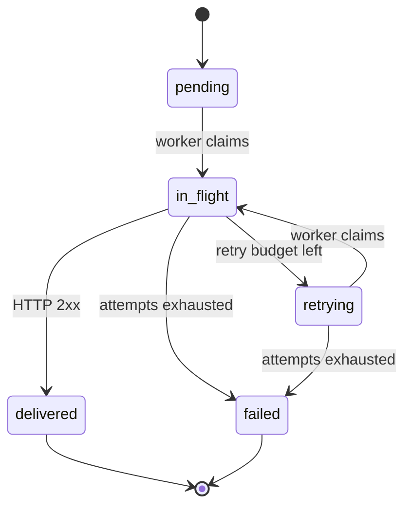

# Webhook.Core — Design Notes

These are the decisions behind the build, written the way I'd explain them at a whiteboard. Code pointers are inline so you can verify the claims.

---

## The problem in one paragraph

A screening engine produces transaction-level events (flagged, cleared, completed) and downstream partners — banks, compliance vendors — need to be told. Doing it inline is wrong: a slow partner would slow the screening pipeline, a partner outage would cascade, and the engine has no business owning HTTP retries. So this service sits between them: it accepts events, owns durability, and pushes to partners with the guarantees that matter — *delivered at least once, ordered per partner, signed, and observable*.

The whole system fits into three planes: ingest (Express API), durable state (Postgres), delivery (worker process). The dashboard reads the same Postgres for visibility.

---

## Data model

Three tables. Boring, on purpose.

- **`Partner`** — id, name, webhookUrl, signingSecret, status, eventTypes filter.
- **`Event`** — the queue *and* the audit row. Carries `externalId` (UNIQUE, the dedup key), partnerId, payload (JSONB), status, attemptCount, `nextAttemptAt`, `lockedAt`, `lockedBy`.
- **`DeliveryAttempt`** — append-only history. One row per HTTP attempt with status code, latency, error, response headers/body.

Two indexes do all the work: `(status, nextAttemptAt)` powers the worker poll, `(partnerId, createdAt)` powers per-partner FIFO. Schema lives at [`backend/prisma/schema.prisma`](backend/prisma/schema.prisma).

I deliberately did **not** split the queue from the event log. One row, one source of truth — no drift between "what we promised to deliver" and "what we actually delivered".





The split between `pending` and `retrying` is observability, not function. Operators want to know *"have we even tried this yet?"* — the claim query treats them identically.

---

## The one query that earns its keep

Everything interesting about delivery happens in one SQL statement in [`backend/src/jobs/delivery-worker.js`](backend/src/jobs/delivery-worker.js):

```sql
UPDATE "Event"
SET status = 'in_flight', "lockedAt" = NOW(),
    "lockedBy" = $1, "attemptCount" = "attemptCount" + 1
WHERE id = (
  SELECT e.id FROM "Event" e
  WHERE e.status IN ('pending', 'retrying')
    AND e."nextAttemptAt" <= NOW()
    AND NOT EXISTS (
      SELECT 1 FROM "Event" e2
      WHERE e2."partnerId" = e."partnerId"
        AND e2.status = 'in_flight'
    )
  ORDER BY e."createdAt" ASC
  FOR UPDATE SKIP LOCKED
  LIMIT 1
)
RETURNING *;
```

Four properties bundled into one statement:

- **`FOR UPDATE SKIP LOCKED`** → two workers never claim the same row.
- **`NOT EXISTS (… in_flight …)`** → at most one event per partner is in flight at a time. That gives FIFO per partner for free.
- **`ORDER BY createdAt ASC`** → oldest pending event wins.
- **`UPDATE … WHERE id = (SELECT …)`** → atomic claim. No race window between read and update.

The reason I'm proud of this: it gives me a real queue with per-partner ordering, cross-partner concurrency, and crash-safe claims — *without* Redis, *without* Kafka, *without* a separate scheduler. Postgres has the primitives; we just have to ask for them in the right order.

Throughput per partner is bounded by one in-flight delivery at a time — roughly `1 / mean_delivery_latency`. Across N partners with K workers, throughput is `min(N, K)`. Slow partners only block themselves, never each other.

---

## Retry strategy

Schedule lives in [`backend/src/utils/backoff.js`](backend/src/utils/backoff.js): `[60s, 5m, 15m, 1h, 6h]` with ±10% jitter. Five attempts, then `failed`.

Why this shape:

- **60s first retry** catches the transient stuff — DNS hiccup, TLS handshake retry, partner restart.
- **5m / 15m** covers normal partner deploys and short outages.
- **1h / 6h** covers actual incidents.
- After 6h of failures the partner is broken and should be paged, not retried mechanically.

The jitter is important. Without it, if a partner has a 5-minute outage and we have 1000 events queued for them, all 1000 retry at the exact same instant — a self-inflicted thundering herd. ±10% spreads the herd out.

The transition rules — success, failure with budget, failure exhausted — live in [`backend/src/services/delivery.service.js`](backend/src/services/delivery.service.js).

---

## Crash recovery

Workers are mortal. If one dies after marking a row `in_flight` but before reaching a terminal status, the row sits there with `lockedAt` set and never moves. Bad.

[`backend/src/jobs/lease-sweeper.js`](backend/src/jobs/lease-sweeper.js) runs every 30s and resets any row where `status='in_flight' AND lockedAt < now - 60s` back to `retrying` with a fresh `nextAttemptAt`. Another worker picks it up.

The cost of this design is occasional duplicate delivery — worker delivered to partner, partner returned 200, worker died before writing `delivered`, sweeper re-queues, second worker delivers again. That's why the partner-side idempotency on `Event-Id` matters; we send the same id on every retry so partners can dedupe.

This is the deliberate at-least-once trade-off. Exactly-once across two systems requires distributed transactions; cheaper to push the dedupe boundary to the partner.

---

## Idempotency

Two independent layers:

**Inbound** — `externalId` has a `UNIQUE` constraint. The ingest path in [`backend/src/services/event.service.js`](backend/src/services/event.service.js) handles the `P2002` race cleanly: the second insert returns the existing row, never a 5xx, never a duplicate enqueue. So if the upstream screening engine retries a POST, we see one event, not two.

**Outbound** — every retry to a partner carries the same `Event-Id` header. Partners are expected to dedupe on it. This is what makes the at-least-once model safe in practice.

Remove either layer and the system breaks: drop inbound and a flapping upstream creates ghost duplicates; drop outbound and crash-recovery double-sends become observable to partners.

---

## Why a separate worker process?

Three reasons:

1. **Latency** — the screening engine is calling us. Its POST has to come back fast (we 202 in <50ms). If I delivered inline, a slow partner would back up ingestion. By splitting, ingest just writes a row and acks; the worker drains at its own pace.
2. **Isolation** — if the worker has a memory leak chasing a bad partner, it doesn't take ingest down with it.
3. **Independent scaling** — workers are stateless. Run one or twenty; the claim query coordinates them.

Same image, two entry points: `src/server.js` for the API, `src/worker.js` for the worker. Compose runs them as separate services with different commands.

---

## Why Postgres only? Why not Redis or Kafka?

The honest answer: I considered Redis Streams and rejected it because adding queue infra adds operational surface, and Postgres already has the primitives. Specifically:

- **One source of truth.** Events, attempts, and partner state in one ACID database, in one transaction. No drift between a queue and a system of record.
- **`FOR UPDATE SKIP LOCKED` + `NOT EXISTS`** gives me row-level claim semantics with per-partner serialization. Redis Streams gives me partitioned consumer groups but no native per-key serialization without extra work.
- **Operational simplicity.** One container to back up, one schema to migrate, one thing to monitor.
- **Migration path is open.** If we hit Postgres limits, the claim logic ports cleanly to Kafka with `partnerId` as the partition key. We're not locked in.

The risk: at very high partner counts and very high event rates, polling the worker query becomes hot. The mitigation is partition `Event` by `createdAt`, hash-index `partnerId`, push read traffic to replicas, and only then reach for an external queue.

---

## Outbound signing

HMAC-SHA256 over the raw request body, with the partner's secret. Worker sends `X-Signature: sha256=<hex>` and `X-Timestamp` on every POST. Implementation: [`backend/src/utils/hmac.js`](backend/src/utils/hmac.js).

Two properties: authenticity (only we have the secret) and integrity (body wasn't tampered with). Timestamp lets the partner reject replays older than N minutes. Signature is over raw bytes, not parsed JSON, so re-serialization differences don't break it.

What I skipped: secret rotation UX. Production would issue a new secret, accept both old and new for an overlap window, then deprecate. Take-home scope.

---

## Scaling story

The honest first bottleneck is a single Postgres taking ingest writes *and* worker polling on the same instance.

Knobs in order:

1. **More workers.** Stateless; the claim query coordinates. Easy first move.
2. **Read replica** for the dashboard and analytics queries — get them off the primary.
3. **Partition `Event`** by `createdAt` (monthly). `DeliveryAttempt` is the fastest-growing table and is a good candidate to push to ClickHouse for analytics.
4. **Hash index on `partnerId`** for the FIFO `NOT EXISTS` lookup once partner counts climb.
5. **Shard by `partnerId`** if a single Postgres ever pegs. The claim query is partner-scoped, so it shards cleanly.
6. **External queue** (Kafka, Redis Streams) only after all of the above.

I'd reach for #6 before #5 in real life — but the order shows the design has runway before infra changes are forced.

---

## Trade-offs I made on purpose

- **At-least-once over exactly-once.** Exactly-once across two systems is distributed-transaction territory. Cheaper to push idempotency to the partner.
- **Polling worker over `LISTEN/NOTIFY`.** Polling at 1s adds at most 1s of latency on a system whose retry baseline is 60s — irrelevant. LISTEN adds connection-storm risk and worse ops.
- **Single Postgres instead of Redis + Postgres.** Operational simplicity; migration path stays open.
- **No dashboard auth.** Take-home scope. Production needs JWT + RBAC + audit log on `redeliver` and `partner.update`.
- **No DLQ redrive UI.** `failed` events are visible in the dashboard but not bulk-redrivable. Two more days of work.
- **No per-partner rate limiting.** Worker will hammer a recovering partner as fast as it can claim. Production needs a token bucket per partner; right place is the worker, not a sidecar.
- **No mTLS to partners.** HMAC is sufficient for the threat model in scope. Production likely needs both for high-trust integrations.
- **Secret stored in DB column.** Good enough for take-home. Production: KMS-wrapped or in Vault.

---

## What I'd do with two more days

1. **AuthN/AuthZ** on the dashboard. JWT, RBAC, audit log.
2. **Circuit breaker per partner.** After K consecutive failures open the breaker for T seconds; one trial event on half-open. Stops one bad partner from burning worker cycles.
3. **OpenTelemetry tracing** end-to-end so I can answer "where did this event spend its time" without grep'ing logs.
4. **DLQ redrive endpoint** with rate limiting and a UI button.

In that order. Auth first because the dashboard is currently anyone-can-do-anything and that's the biggest gap between this and shippable.

---

## Failure modes I'm watching for

- **Partner returns 200 but didn't persist the event.** No protocol-level fix. Mitigate with a reconciliation job (`GET /events/:id` on partner side) and contractual idempotency.
- **Clock skew on the timestamp header** causing replay-window false negatives. NTP-synced clocks and a generous window.
- **Long retry tails** filling the table. Eventually need partition + archive.
- **One worker pinned on a slow partner.** Bounded already by the `NOT EXISTS` predicate (other workers walk past), but I'd add per-partner concurrency cap explicitly in production.
- **Compromised partner secret.** Detected by spike in 401s from partner's verification side. Rotate via dashboard.

---

## File map (quick reference)

| Concern | File |
|---|---|
| Schema, indexes | [`backend/prisma/schema.prisma`](backend/prisma/schema.prisma) |
| Atomic claim query | [`backend/src/jobs/delivery-worker.js`](backend/src/jobs/delivery-worker.js) |
| Lease sweeper | [`backend/src/jobs/lease-sweeper.js`](backend/src/jobs/lease-sweeper.js) |
| Backoff schedule + jitter | [`backend/src/utils/backoff.js`](backend/src/utils/backoff.js) |
| HMAC sign/verify | [`backend/src/utils/hmac.js`](backend/src/utils/hmac.js) |
| Event ingest + idempotency | [`backend/src/services/event.service.js`](backend/src/services/event.service.js) |
| Single-attempt processing | [`backend/src/services/delivery.service.js`](backend/src/services/delivery.service.js) |
| API entrypoint | [`backend/src/server.js`](backend/src/server.js) |
| Worker entrypoint | [`backend/src/worker.js`](backend/src/worker.js) |
| Mock partner | [`mock-partner/server.js`](mock-partner/server.js) |
| Continuous ingestion (demo) | [`scripts/simulate-screening.js`](scripts/simulate-screening.js) (Compose: `simulate-screening` + idempotent **Demo Partner** via [`scripts/ensure-default-partner.js`](scripts/ensure-default-partner.js) / `default-partner`) |
