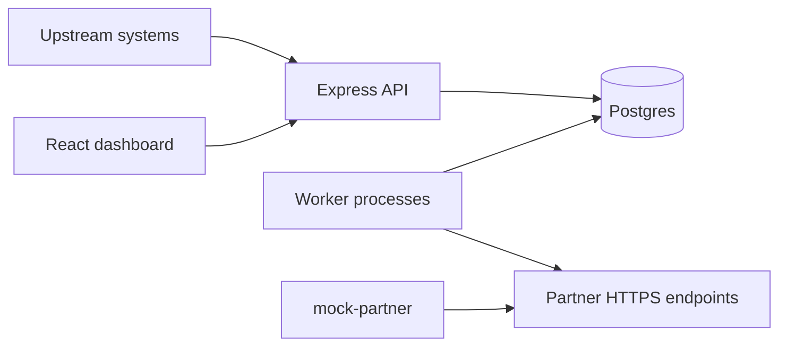

# Webhook.Core

Financial webhook ingestion and delivery platform: HTTP ingestion API, Postgres-backed queue semantics with **per-partner FIFO**, **HMAC-signed** outbound POSTs, exponential backoff retries, and an operational **React** dashboard.

## Prerequisites

- **Docker** and **Docker Compose v2** — if you do not have them yet, [install Docker Desktop](https://docs.docker.com/get-docker/) (macOS/Windows) or [Docker Engine + Compose plugin](https://docs.docker.com/engine/install/) (Linux). The `docker compose` commands in this README assume a working local Docker install.
- Node.js **20** (for local dev outside compose)

## Quick start (Docker Compose)

From the repo root:

```bash
docker compose up --build
```

Services:

| Service       | Port (host) | Notes                                      |
|---------------|-------------|--------------------------------------------|
| Postgres      | 5433→5432   | Host port 5433 if 5432 is taken locally   |
| Backend API   | **3010**→3000 | Avoids clash when host **3000** is used by another app |
| Worker        | —           | Same image as API, `node src/worker.js`    |
| Mock partner  | 4001        | Random HTTP outcomes + HMAC verification   |
| Frontend      | 5173        | nginx serving Vite build                   |

The backend and worker containers run `prisma migrate deploy` automatically on startup, so the schema is created on first boot — no manual migrate step needed.

Seed demo partners + 200 sample events (expects API reachable from your shell):

```bash
cd backend
cp ../.env.example .env   # adjust DATABASE_URL if not using compose defaults
npm install
export API_URL=http://localhost:3010
export MOCK_URL=http://mock-partner:4001
npm run seed
```

Then open **http://localhost:5173** (dashboard) and **http://localhost:3010/healthz**.

If port **3000** is free on your machine, you can map the API as `"3000:3000"` in `docker-compose.yml` and set `VITE_API_BASE_URL` / `API_URL` to `http://localhost:3000` instead.

### Live screening simulation (demos)

With the API up and at least one partner in the database (from seed or the UI), run a **continuous fake upstream screening** process that `POST`s mixed events to the ingestion API—same path a real screening engine would use. Open **Overview** in the browser to watch KPIs and the live feed update.

```bash
# From repo root; match host port to docker-compose (3010 in default compose)
export API_URL=http://localhost:3010
node scripts/simulate-screening.js
```

| Env | Default | Purpose |
|-----|---------|---------|
| `API_URL` | `http://localhost:3010` | Base URL of the Webhook.Core API |
| `INTERVAL_MS` | `12000` | Milliseconds between batches |
| `EVENTS_PER_TICK` | `4` | Events sent each interval |
| `PARTNER_IDS` | _(empty)_ | Comma-separated partner ids to rotate (subset) |
| `DEDUP_EVERY` | _(off)_ | After every N successful ingests, replay **same** `external_id` once to demo idempotency (`created: false`) |

Stop with **Ctrl+C**.

## Demo 

End-to-end script for reviewers: **Compose stack → migrate → dashboard → screening simulator → mock partner logs**.

1. **Clean start** (from repo root):
   ```bash
   docker compose down -v
   docker compose up --build -d
   ```
2. **Migrations** run automatically on container startup (Prisma `migrate deploy`).
3. **Data** (optional if DB is empty): seed demo partners/events — see **Quick start (Docker Compose)** and the `npm run seed` block above, or register partners in the UI.
4. **Smoke checks** — default Compose publishes the API on host **3010** (see table above):
   ```bash
   curl -s http://localhost:3010/healthz
   curl -s -o /dev/null -w "%{http_code}" http://localhost:5173/
   ```
   Open **http://localhost:5173** → Overview shows KPIs and the live feed; **Events** refreshes near real-time.
5. **Continuous ingestion** (second terminal — use the same host port as `docker-compose.yml` maps for `backend`):
   ```bash
   export API_URL=http://localhost:3010
   node scripts/simulate-screening.js
   ```
6. **Verify delivery**: tail the mock receiver to see signed POSTs from the worker:
   ```bash
   docker compose logs -f mock-partner
   ```

If you change the API mapping to `3000:3000`, set `API_URL` and `VITE_API_BASE_URL` to `http://localhost:3000` consistently.

## Local development

### Backend

```bash
cd backend
npm install
npx prisma migrate dev
npm run dev        # API
npm run worker     # worker (separate terminal)
```

### Frontend

```bash
cd frontend
npm install
echo 'VITE_API_BASE_URL=http://localhost:3010' > .env.local
npm run dev        # Vite on http://localhost:5173
```

## Architecture



## API (summary)

All JSON responses use `{ ok: true, data }` or `{ ok: false, error: { code, message } }`.

| Method | Path | Purpose |
|--------|------|---------|
| POST | `/api/v1/partners` | Register partner (returns `signingSecret` once) |
| GET | `/api/v1/partners` | List partners |
| GET/PATCH/DELETE | `/api/v1/partners/:id` | Read / update / soft-disable |
| POST | `/api/v1/partners/:id/test` | Synthetic ingest |
| POST | `/api/v1/events` | Ingest (`202` new, `200` duplicate `external_id`) |
| GET | `/api/v1/events` | Filtered list |
| GET | `/api/v1/events/:id` | Detail + attempts |
| POST | `/api/v1/events/:id/redeliver` | Reset retries |
| GET | `/api/v1/stats/overview` | KPIs + charts + feed |
| GET | `/api/v1/stats/live-events` | Last five events |
| GET | `/healthz` | Liveness + DB ping |

See [DESIGN.md](./DESIGN.md) for delivery internals and trade-offs.

## Screenshots

Captured from the Compose-backed dashboard (`docker compose up`) with seed data.

| File | Description |
|------|-------------|
| [docs/screenshots/01-overview.png](docs/screenshots/01-overview.png) | Overview — KPIs, chart, live feed |
| [docs/screenshots/02-events-list.png](docs/screenshots/02-events-list.png) | Events list with status filter |
| [docs/screenshots/03-event-detail.png](docs/screenshots/03-event-detail.png) | Event detail — payload + attempts |
| [docs/screenshots/04-partners.png](docs/screenshots/04-partners.png) | Partners grid |
| [docs/screenshots/05-register-modal.png](docs/screenshots/05-register-modal.png) | Register Partner — signing secret (demo query `?register=1&demoSecret=1` for static shots) |

## Tech stack

- Node 20, Express, Prisma + Postgres 16, `node-fetch`, `pino`, Joi  
- Worker entrypoint `src/worker.js`, lease sweeper + atomic SQL claim  
- React 18 + Vite, Tailwind, TanStack Query, axios, Recharts, lucide-react  
- Docker multi-stage images for API/worker/frontend/mock receiver  

## CI

GitHub Actions workflow `.github/workflows/ci.yml` runs frontend lint/build, backend Prisma generate + syntax checks, and Docker image builds.

## Deployment hints

- **Netlify**: see `frontend/netlify.toml` for SPA build settings.  
- **Render**: see `render.yaml` for a blueprint-style outline of API + worker + DB.

## License

Private / assignment repository—reuse only with permission from the author.
