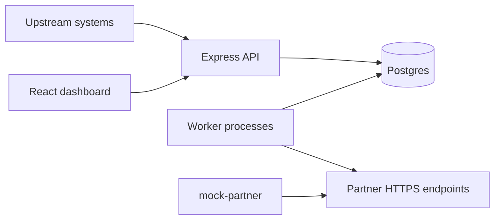

# Webhook.Core

Financial webhook ingestion and delivery platform: HTTP ingestion API, Postgres-backed queue semantics with **per-partner FIFO**, **HMAC-signed** outbound POSTs, exponential backoff retries, and an operational **React** dashboard.

## Prerequisites

- Docker + Docker Compose v2  
- Node.js **20** (for local dev outside compose)

## Quick start (Docker Compose)

From the repo root:

```bash
docker compose up --build
```

Services:

| Service       | Port (host) | Notes                                      |
|---------------|-------------|--------------------------------------------|
| Postgres      | 5432        | `DATABASE_URL` defaults in compose         |
| Backend API   | 3000        | `GET /healthz`, `/api/v1/*`                |
| Worker        | —           | Same image as API, `node src/worker.js`    |
| Mock partner  | 4001        | Random HTTP outcomes + HMAC verification   |
| Frontend      | 5173        | nginx serving Vite build                   |

Apply migrations once (API container has Prisma CLI):

```bash
docker compose exec backend npx prisma migrate deploy
```

Seed demo partners + 200 sample events (expects API reachable from your shell):

```bash
cd backend
cp ../.env.example .env   # adjust DATABASE_URL if not using compose defaults
npm install
export API_URL=http://localhost:3000
export MOCK_URL=http://localhost:4001   # use http://mock-partner:4001 from inside compose network
npm run seed
```

Then open **http://localhost:5173** (dashboard) and **http://localhost:3000/healthz**.

## Local development

### Backend

```bash
cd backend
npm install
npx prisma migrate dev
npm run dev        # API
npm run worker     # worker (separate terminal)
```

### Frontend

```bash
cd frontend
npm install
echo 'VITE_API_BASE_URL=http://localhost:3000' > .env.local
npm run dev        # Vite on http://localhost:5173
```

## Architecture



## API (summary)

All JSON responses use `{ ok: true, data }` or `{ ok: false, error: { code, message } }`.

| Method | Path | Purpose |
|--------|------|---------|
| POST | `/api/v1/partners` | Register partner (returns `signingSecret` once) |
| GET | `/api/v1/partners` | List partners |
| GET/PATCH/DELETE | `/api/v1/partners/:id` | Read / update / soft-disable |
| POST | `/api/v1/partners/:id/test` | Synthetic ingest |
| POST | `/api/v1/events` | Ingest (`202` new, `200` duplicate `external_id`) |
| GET | `/api/v1/events` | Filtered list |
| GET | `/api/v1/events/:id` | Detail + attempts |
| POST | `/api/v1/events/:id/redeliver` | Reset retries |
| GET | `/api/v1/stats/overview` | KPIs + charts + feed |
| GET | `/api/v1/stats/live-events` | Last five events |
| GET | `/healthz` | Liveness + DB ping |

See [DESIGN.md](./DESIGN.md) for delivery internals and trade-offs.

## Screenshots

Reference UI exports live in `docs/screenshots/` (Overview, Events, Detail, Partners).

## Tech stack

- Node 20, Express, Prisma + Postgres 16, `node-fetch`, `pino`, Joi  
- Worker entrypoint `src/worker.js`, lease sweeper + atomic SQL claim  
- React 18 + Vite, Tailwind, TanStack Query, axios, Recharts, lucide-react  
- Docker multi-stage images for API/worker/frontend/mock receiver  

## CI

GitHub Actions workflow `.github/workflows/ci.yml` runs frontend lint/build, backend Prisma generate + syntax checks, and Docker image builds.

## Deployment hints

- **Netlify**: see `frontend/netlify.toml` for SPA build settings.  
- **Render**: see `render.yaml` for a blueprint-style outline of API + worker + DB.

## License

Private / assignment repository—reuse only with permission from the author.
